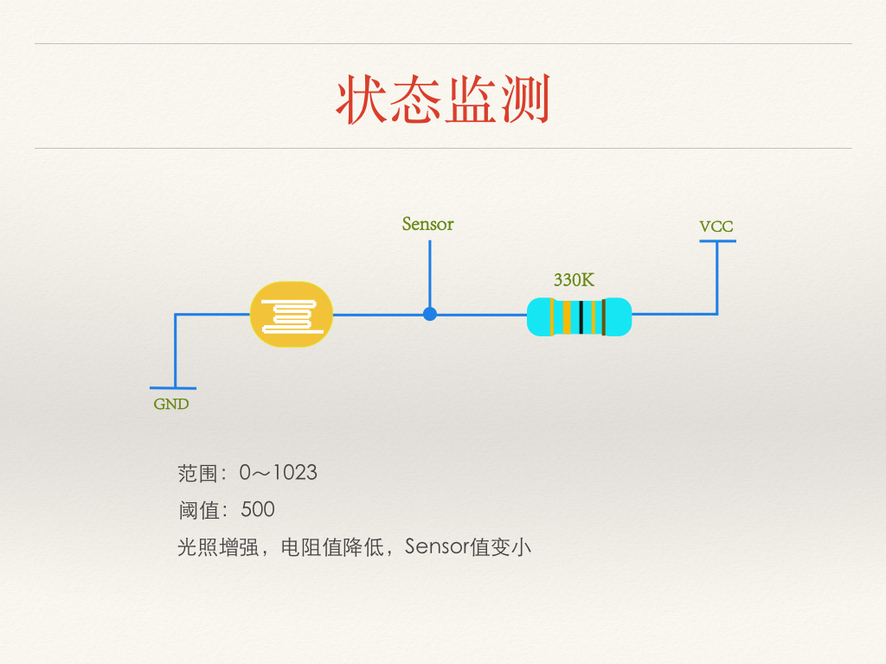

#中央空调控制器-制作篇

##Arduino

引脚图如下图:

##扩展板

扩展板为每个IO口都准备了VCC和GND

| 扩展板	| Arduino	|
|----	|----	|
| G	| GND	|
| V	| VCC	|
| S	| IO口	|

除此之外,扩展板还准备了3.3V的电源(AMS1117 3.3),UART(串口),I2C(SDA,SCL).

我们需要将Arduino插入扩展板上.

#接线

##时钟模块

时钟模块使用了I2C接口,接在Arduino的扩展板上

| DS3231	| Arduino	|
|----	|----	|
| VCC	| VCC	|
| GND	| GND	|
| SDA	| SDA	|
| SCL	| SCL	|

##LCD2004

我们可以将多个设备都接入I2C总线中,刚好DS3132为我们准备好了I2C接口,因此我们可以直接将LCD2004接入DS3231的I2C接口.

| LCD2004	| DS3231	|
|----	|----	|
| VCC	| VCC	|
| GND	| GND	|
| SDA	| SDA	|
| SCL	| SCL	|

##DHT22

DHT22采用单总线协议,与DHT11协议相同,因此只用一个IO口即可读取温湿度信息.

我们定义DHT22的网状面为正,从左至右分别为1234引脚.

| DHT22	| Arduino	|
|----	|----	|
| 1	| VCC	|
| 2	| 2	|
| 3	| 不接	|
| 4	| GND	|

##光敏电阻

光敏电阻是模拟器件,我们将光敏电阻和一个330k的电阻串联在一起,再利用电阻分压,取出中间的电压.

中间需要将杜邦线切开,将铜丝焊在电阻和光敏电阻上,最后将引出的sensor接在A0口上.

| Sensor	| Arduino	|
|----	|----	|
| VCC	| VCC	|
| Sensor	| A0	|
| GND	| GND	|

##舵机

FUTABA S3003舵机是机器鱼内部使用的舵机之一,舵机需要使用PWM信号来控制,因此我们需要将舵机接在Arduino的PWM口上.

Arduino Nano上的PWM口有3,5,6,9,10,11这么几个,我们接的是3.

舵机上的线与Arduino是配套的.

| 舵机	| Arduino	|
|----	|----	|
| 黑	| GND	|
| 红	| VCC	|
| 白	| 3	|

直接插在3口上即可.

##WIFI模块

wifi模块使用的串口与电脑会**冲突**,因此我们需要在**烧完程序后**再接入wifi模块.

串口是一种简单的通讯协议,RXD代表读,TXD代表写,因此单片机的RXD要接wifi模块的TXD,单片机的TXD要接wifi模块的RXD.

| wifi模块	| Arduino	|
| ----	| ----	|
| GND	| GND	|
| VCC	| VCC	|
| RXD	| TXD	|
| TXD	| RXD	|