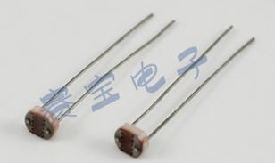

#中央空调控制器-制作篇

##原材料购买

| 名称	| 图片	| 价格	| 链接	|
|----	|----	|----	|----	|
| Arduino	| 	| 24	| [Arduino Nano](http://item.taobao.com/item.htm?spm=a1z10.5-c.w4002-1685197539.15.8GlHtd&id=15733833441)	|
| 扩展板	|		| 10	| 	|
| mini USB线	| 	| 2.5	| [mini USB](http://item.taobao.com/item.htm?spm=a1z10.5-c.w4002-1685197539.15.jVZ8R7&id=40351849521)	|
| DS3231	| 	| 5	| [DS3231](http://item.taobao.com/item.htm?spm=a1z10.5-c.w4002-1685197539.9.zM67k6&id=37488105948)	|
| **I2C** LCD2004	| 	| 21	| [LCD2004](http://item.taobao.com/item.htm?spm=a1z10.5-c.w4002-1685197539.15.2V98uJ&id=19385040494)	|
| DHT22	| 	| 17	| [DHT22](http://item.taobao.com/item.htm?spm=a1z10.3-c.w4002-1685211022.11.7KKKOE&id=6322475249)	|
| 光敏电阻	| 	| 1.2	| [光敏电阻](http://item.taobao.com/item.htm?spm=a1z10.5-c.w4002-1685197539.25.642x7C&id=12859015990)	|
| 杜邦线	| 	| 3.5	| [杜邦线](http://item.taobao.com/item.htm?spm=a1z10.3-c.w4002-1685211022.14.6rCGUc&id=6203202913)	|
| FUTABA S3003	| 	| 55	| [S3003](http://item.taobao.com/item.htm?spm=a230r.1.14.24.It07lO&id=35577062480&ns=1&abbucket=14#detail)	|
| WIFI模块(买内置天线的)	| 	| 144	| [WIFI](http://detail.tmall.com/item.htm?spm=a1z10.3-b.w4011-5602082699.69.b2opiF&id=22288063406&rn=7bcc4a5a12cc9e0be7ff90f1e38b9644&abbucket=16)	|
