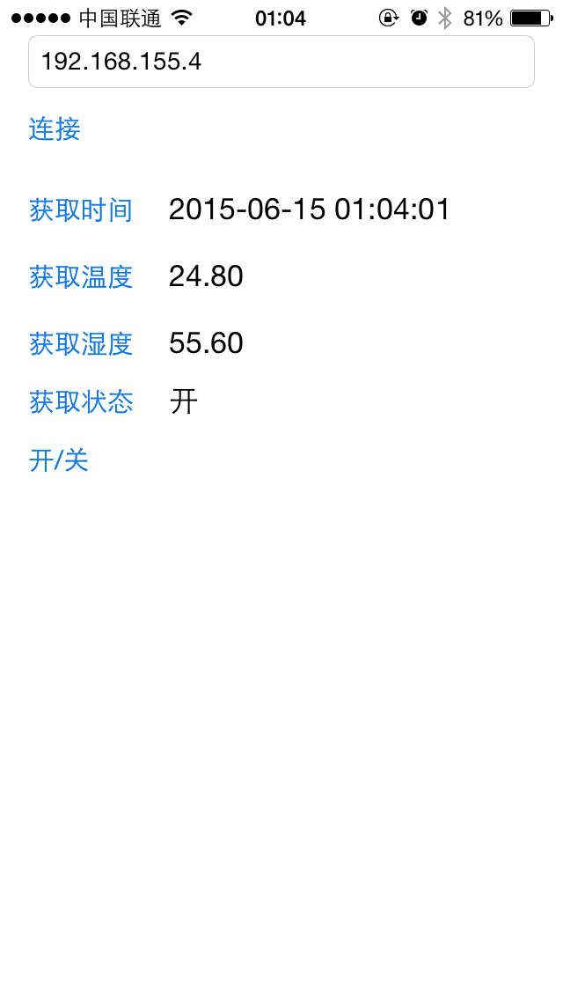

#中央空调控制器-使用篇

##控制命令

| 功能	| 代码	| 方向	|
|----	|----	|----	|
| 设置时间	| 0x80	| 写入	|
| 获取时间	| 0x81	| 读出	| 
| 获取温度	| 0x82	| 读出	|
| 获取湿度	| 0x83	| 读出	|
| 获取空调状态	| 0x84	| 读出	|
| 远程按下开关	| 0x85	| 写入	|

以下是部分举例:

| 功能	| 举例/效果	|
|----	|----	|
| 设置时间	| 发送:`0x80`2015-06-10 20:12:12`0x80`	|
| 获取时间	| 接收:2015-06-10 20:12:12	|
| 获取温度	| 接收:24.00	|
| 获取湿度	| 接收:67.00	|
| 获取空调状态	| 接收:1	|
| 远程按下开关	| 看到:开关按下	|

##APP

我们专门制作了一个APP来远程控制空调:

###[airConditioner iOS版本](https://github.com/ypwhs/airConditioner)

